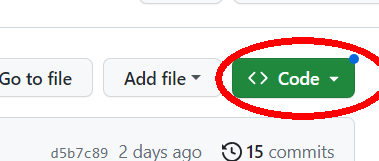
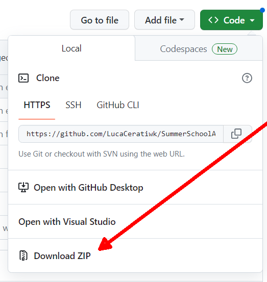
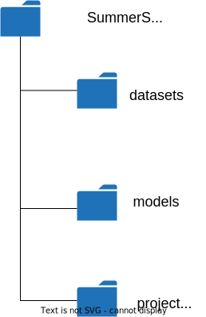
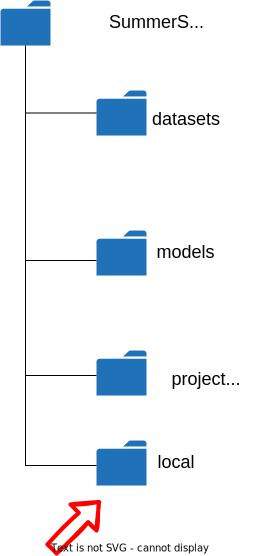

# Ambiente di progetto
Qui di seguito la guida passo-passo per preparare l'ambiente.

## Tool base
Abbiamo già scaricato e installato tutti i tool che ci servono:

- Interprete `python`
[Download Python | Python.org](https://www.python.org/downloads/)

- `git`  "**Git** is a free and open source distributed version control system designed to handle everything from small to very large projects with speed and efficiency."
[Git - Downloads (git-scm.com)](https://git-scm.com/downloads)

- Editor / IDE `VS Code`
[Download Visual Studio Code - Mac, Linux, Windows](https://code.visualstudio.com/download)

## Installazioni
Da terminale (qui vi aiutiamo, se non sapete come fare): 
``` shell
pip install python-telegram-bot
```

e poi:

``` shell
pip install tensorflow
```

## Codice
Collegatevi al repository:
[LucaCeratiwk/SummerSchoolAI_2023: A tutorial for the project work presentation of 2023 MAST Summer School AI thread (github.com)](https://github.com/LucaCeratiwk/SummerSchoolAI_2023)

Scaricate il file `.zip` contenente tutta la struttura.





Scegliete un folder oppure createne uno e "unzippate" la cartella. Vi troverete con una struttura come questa:



File che trovate nei folder (i file e i folder non riportati qui non ci interessano per ora):

- in `SummerSchoolAI_2023` trovate file di licenza e documentazione, incluso questo `README.md`.
- in `datasets` trovate altre due cartelle ognuna delle quali contiene le immagini utilizzate per l'addestramento del rispettivo modello: non usiamo `animals-imgs`. Ci limitiamo a `garbage-imgs`: trovate un folder per ciascuna categoria (o classe) e un folder con immagini di test che servono appunto per testare il modello.
- in `model` trovate un folder `garbage-model`: all'interno di questo trovate due file che nell'insieme costituiscono il modello realizzato su Teachable Machine: `keras_model.h5` e `labels.txt`
- in `project_work` trovate:
	- `chatbot.py` che è lo script che abbiamo provato a costruire insieme (il "motore" che interpreta i comandi e risponde attraverso il bot Telegram)
	- `test_model.py` che è lo script che viene utilizzato da `chatbot.py` per "interrogare" i file che rappresentano il modello
	- `picture.jpg` è un'immagine di test che viene utilizzata tutte le volte che parte lo script per testare che sia tutto ok anche senza richieste da bot

⚠ **dovete aggiungere un folder** `local` ⚠



Il folder `local` contiene un file che defnisce un valore utilizzato da `chatbot.py` e uno utilizzato da `test_model.py`.
I valori in questo file devono essere tenuti solo in locale per ragioni di sicurezza e di praticità.

Quindi all'interno di `local` create un file `config.py` e scrivete solo le seguenti due righe, inserendo nella prima il token del bot che avete generato:

``` python
TOKEN = "qui-mettete-il-vostro-token"
REPO_ABSOLUTE_PATH = r".."
```

Il token del bot vi è stato fornito alla generazione del bot stesso da parte di [@BotFather](https://web.telegram.org/k/#@BotFather)

## A questo punto
Avete la struttura necessaria per inserire il modello che realizzerete su Teachable Machine (:point_right:**secondo la vostra idea**:point_left:) e comunicare attraverso il bot Telegram.


